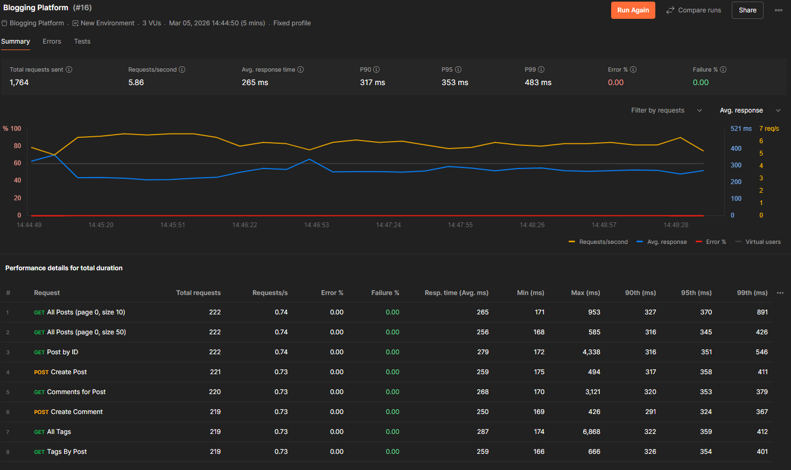
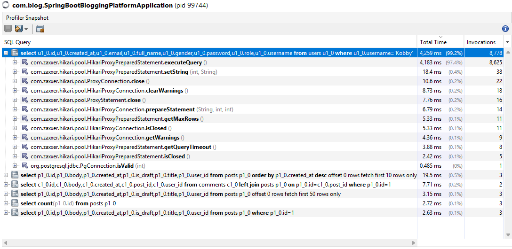
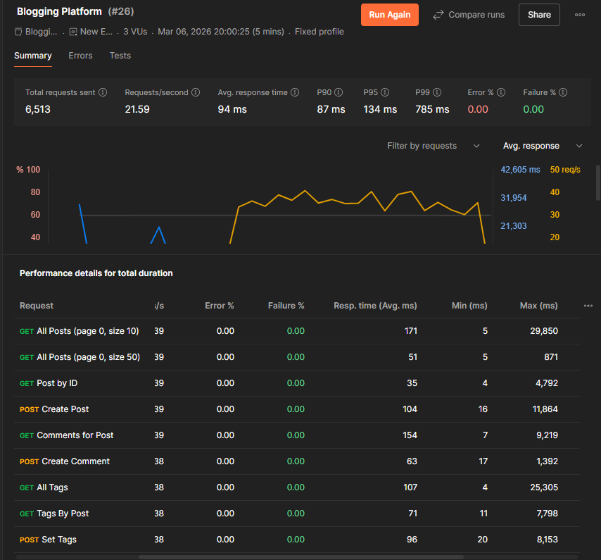

# Blogging Platform -- Performance Bottleneck Analysis (Epic 1)

## Overview

This report documents the performance bottleneck analysis conducted on
the Spring Boot Blogging Platform backend. The goal of this phase was to
identify system performance issues before applying optimization
techniques in later epics.

Profiling and load testing were performed to analyze API latency,
database performance, and system behavior under concurrent requests.

------------------------------------------------------------------------

## Tools Used

  -----------------------------------------------------------------------
  Tool                        |Purpose
  --------------------------- |-------------------------------------------
  VisualVM                    |Application profiling and hotspot analysis
  Postman Collection Runner   |Load testing and concurrent API simulation
  Spring Boot 3.x             |Backend framework
  Java 21                     |Application runtime
  PostgreSQL                  |Databasee
  -----------------------------------------------------------------------

------------------------------------------------------------------------

## Test Methodology

The backend application was executed locally while performance profiling
was conducted using VisualVM.

Load tests were performed using Postman Collection Runner with multiple
API endpoints including:

-   GET All Posts
-   GET Post by ID
-   POST Create Post
-   GET Comments for Post
-   POST Create Comment
-   GET All Tags
-   GET Tags by Post

Multiple requests were executed concurrently to simulate real-world API
usage.

------------------------------------------------------------------------

## Baseline Performance Metrics

### Load Test Run


  Metric                  |Value
  ----------------------- |--------
  Total Requests          |1,764
  Requests per Second     |5.86
  Average Response Time   |265 ms
  P90 Latency             |317 ms
  P95 Latency             |353 ms
  P99 Latency             |483 ms
  Error Rate              |0%

In VisualVM, the database query responsible for retrieving authenticated


------------------------------------------------------------------------

## Identified Performance Bottleneck

Profiling results from VisualVM revealed that the majority of
application execution time was spent retrieving user data from the
database during authentication.

### Database Query

``` sql
SELECT id, username, email, password FROM users WHERE username = ?
```

### Profiling Metrics

  Metric                  |Value
  ----------------------- |----------
  Total Execution Time    |4,259 ms
  Percentage of Runtime   |99.2%
  Query Invocations       |8,778

The database query responsible for retrieving authenticated user details
was executed thousands of times during load testing.

------------------------------------------------------------------------

## Root Cause Analysis

The performance issue occurs because the application repeatedly queries
the database to retrieve the currently authenticated user during each
API request.

This behavior is commonly triggered by the Spring Security
authentication mechanism:

    UserDetailsService.loadUserByUsername()

Since each request requires user validation, the system performs
repeated database lookups even when the user information does not
change.

This leads to:

-   Increased database load
-   Higher response latency
-   Reduced throughput under heavy traffic

------------------------------------------------------------------------

## Impact on System Performance

The repeated user lookup query significantly impacts overall performance
by:

-   Increasing request processing time
-   Creating unnecessary database traffic
-   Reducing system scalability during concurrent requests

This effect becomes more noticeable under higher load conditions, where
average response time increased from **39 ms to 265 ms**.


# Implemented Optimizations

## Asynchronous Processing

Several backend operations were converted to asynchronous execution
using: - `@Async` - `CompletableFuture` - Custom
`ThreadPoolTaskExecutor`

This allowed non‑blocking request processing and improved concurrency.

------------------------------------------------------------------------
## Thread Pool Configuration

A dedicated executor was configured for async tasks:

``` java
ThreadPoolTaskExecutor blogExecutor
```

Configuration: - Core Pool Size: 5 - Max Pool Size: 20 - Queue Capacity:
200

------------------------------------------------------------------------

# Load Test Results (After Optimization)


|Metric                  |Value
  ----------------------- |--------
  Total Requests          |6,513
  Requests/sec            |21.59
  Average Response Time   |94 ms
  P90 Latency             |87 ms
  P95 Latency             |134 ms
  P99 Latency             |785 ms
  Error Rate              |0%

The system maintained stable performance with **zero failures** during
the load test.

------------------------------------------------------------------------

# Performance Comparison

  Metric                  |Before Optimization   |After Optimization
  ----------------------- |--------------------- |--------------------
  Average Response Time   |\~265 ms              |94 ms
  Requests/sec            |5.86                  |21.59
  Error Rate              |0%                    |0%

The optimizations improved both response times and system throughput.

------------------------------------------------------------------------

# Key improvements

-   Database load reduced through caching
-   Pagination limited dataset size
-   Asynchronous processing improved concurrency
-   Thread pools controlled background execution
-   System maintained zero error rate under load.


